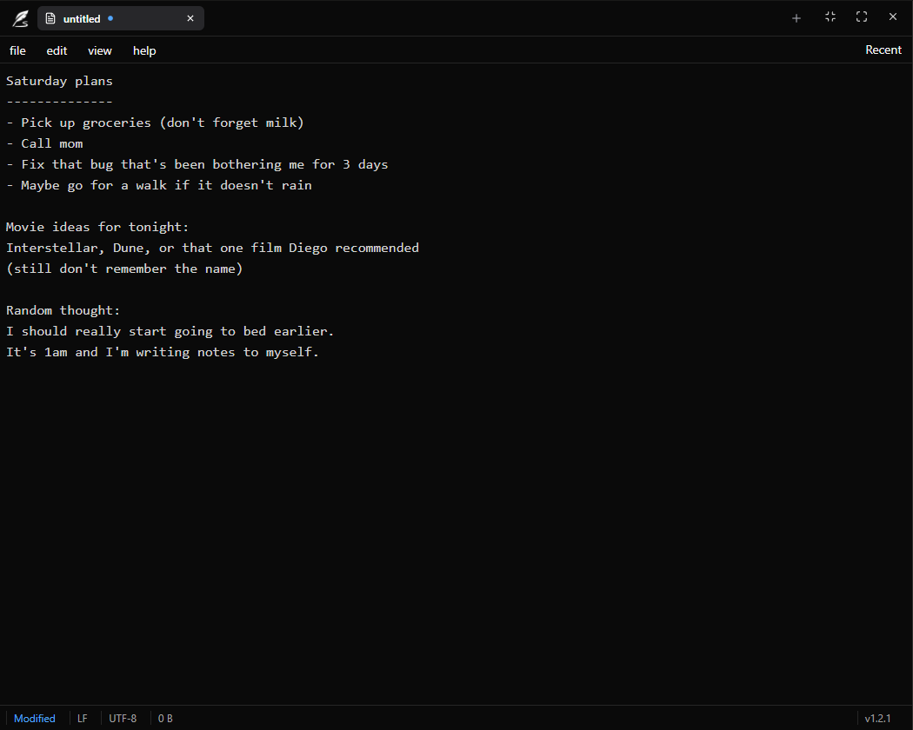

# Taking Notes

A desktop note-taking app built with Tauri and React. Designed to bring modern editing features to a lightweight, fast, and always-available experience.

## Features

- Full CRUD support for plain-text notes.
- Multi-tab support for working with multiple files at once.
- Automatic session saving on close and seamless recovery on launch to prevent data loss.
- Automatic updates via GitHub Releases.
- Dark mode enabled by default.
- Responsive layout optimized for different screen sizes.

## Inspiration

The Windows 10 Notepad works, but it lacks features that Windows 11 introduced, like multi-tab support, multiple windows, and session recovery for unsaved files. Taking Notes was built to bring those features to a lightweight desktop app, while also serving as my first project with Tauri.

## Releases

Taking Notes uses the [Tauri Updater plugin](https://tauri.app/plugin/updater/) combined with GitHub Releases to deliver automatic updates. When a new version is available, the app detects it on launch and prompts the user to update without needing to manually download or reinstall anything.
